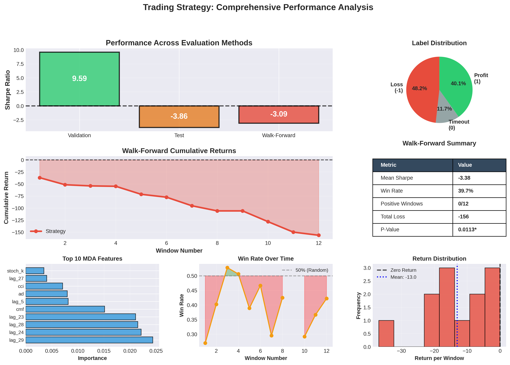
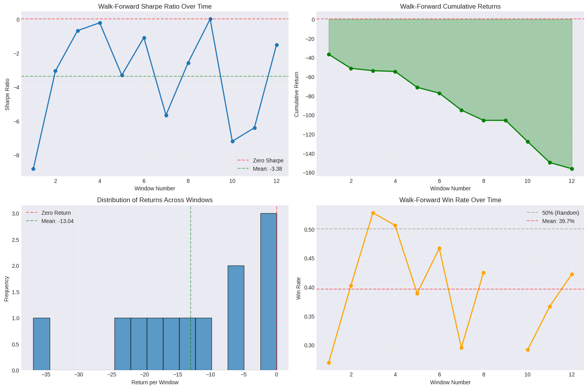
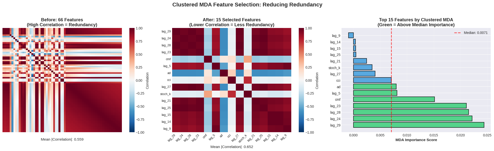
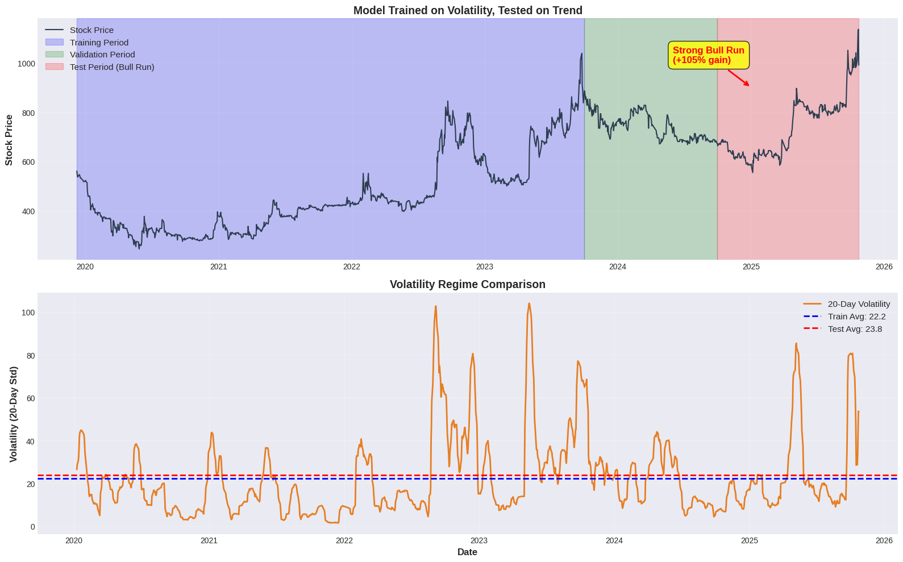

# Financial ML Regime Analysis

[](https://www.python.org/)
[](https://xgboost.readthedocs.io/)
[](LICENSE)

> Advanced machine learning trading strategy implementing López de Prado's techniques to analyze regime-change impacts on model performance.



---

## 📊 Overview

This project implements an advanced machine learning trading strategy using techniques from Marcos López de Prado's *Advances in Financial Machine Learning*. The analysis demonstrates rigorous methodology including triple-barrier labeling, clustered MDA feature selection, meta-labeling, and walk-forward validation across 12 time windows.

### Key Insight

The project reveals how market regime changes impact strategy performance: a mean-reversion strategy trained on volatile markets (2019-2023) systematically failed when tested on a trending bull market (2024-2025).

### What Makes This Project Valuable

- ✅ **Rigorous methodology:** Advanced financial ML techniques properly implemented
- ✅ **Honest analysis:** Reports findings transparently with statistical significance testing
- ✅ **Root cause investigation:** Identifies regime change as primary failure mechanism
- ✅ **Educational value:** Demonstrates critical challenges in production ML systems

---

## 🎯 Performance Summary

| Evaluation Method | Sharpe Ratio | Total Return | Win Rate | Statistical Test |
|-------------------|--------------|--------------|----------|------------------|
| **Validation** | 9.59 | +4.14% | 68.8% | Single period |
| **Test** | -3.86 | -17.55% | 43.3% | Single period |
| **Walk-Forward** | **-3.09** | **-124.31%** | **40.5%** | **p = 0.011*** |

*p < 0.05: Statistically significant negative returns across 12 independent time windows



---

## 🔬 Technical Implementation

### Advanced Techniques

**1. Triple-Barrier Labeling**
- Profit target: +2% | Stop-loss: -2% | Max holding: 10 days
- Captures both direction and magnitude for position sizing
- Addresses label imbalance in traditional next-day return methods

**2. Clustered Mean Decrease Accuracy (MDA)**
- Reduces 66 features to 15 while handling correlation properly
- Groups similar features before importance evaluation
- More robust than standard tree-based importance

**3. Meta-Labeling**
- Secondary model predicts primary model confidence
- Filters low-quality trades (min confidence: 60%)
- Emphasizes precision over recall for capital preservation

**4. Enhanced ETF Trick**
- Dynamic position sizing: `size = confidence_factor × magnitude_factor`
- Scales positions based on both confidence and predicted return
- Linear scaling between 60-75% confidence thresholds

**5. Walk-Forward Validation**
- 12 rolling windows: 600-day training, 120-day testing
- 60-day step size (quarterly retraining simulation)
- Tests true out-of-sample performance



---

## 📈 Regime Analysis

### Training Period (2019-2023): Mean-Reversion Market
- Volatile, range-bound trading
- Price oscillations between support/resistance levels
- Strategy learned: Buy dips, sell rallies
- **Result:** Validation Sharpe 9.59 ✓

### Test Period (2024-2025): Momentum Market
- Strong sustained uptrend (+105% peak-to-trough)
- Consistent higher highs and higher lows
- Strategy executed: Sold rallies expecting reversals
- **Result:** Walk-Forward Sharpe -3.09 ✗

### Key Takeaway

Static mean-reversion strategies cannot adapt to momentum regimes without explicit regime detection and strategy switching mechanisms.



---

## 🛠️ Technologies

- **Language:** Python 3.12
- **ML Framework:** XGBoost 2.0, scikit-learn 1.3
- **Data Processing:** pandas 2.0, numpy 1.24
- **Visualization:** matplotlib 3.7, seaborn 0.12, plotly 5.14
- **Financial Analysis:** pandas-ta 0.3, yfinance 0.2

---

## 🚀 Getting Started

### Prerequisites

```bash
Python >= 3.10
pip >= 21.0
```

### Installation

```bash
# Clone repository
git clone https://github.com/yourusername/financial-ml-regime-analysis.git
cd financial-ml-regime-analysis

# Create virtual environment
python -m venv venv
source venv/bin/activate  # On Windows: venv\Scripts\activate

# Install dependencies
pip install -r requirements.txt
```

### Running the Analysis

```bash
# Launch Jupyter Notebook
jupyter notebook

# Open notebooks/trading_strategy_analysis.ipynb
# Run all cells: Cell → Run All
```

### Expected Runtime

- Full notebook execution: ~5-10 minutes
- Walk-forward validation: ~3-5 minutes
- All visualizations: ~2 minutes

---

## 📁 Repository Structure

```
financial-ml-regime-analysis/
├── notebooks/
│   └── trading_strategy_analysis.ipynb  # Main analysis notebook
├── data/
│   ├── KEEN_2019_2025.csv                   # Stock data (KEEN.JK)
│   └── README.md                         # Data documentation
├── images/                               # Result visualizations
│   ├── dashboard.png
│   ├── clustered_mda_before_after.png
│   ├── regime_timeline.png
│   └── walk_forward.png
├── requirements.txt                      # Python dependencies
├── .gitignore                            # Git exclusions
├── LICENSE                               # MIT License
└── README.md                             # This file
```

---

## 📚 Methodology Details

### Data

**Stock:** PT Kencana Energi Lestari (KEEN.JK)  
**Period:** October 2019 - October 2025 (6 years)  
**Frequency:** Daily OHLCV  
**Source:** Yahoo Finance

**Selection Rationale:**
- Recent IPO (2019) tests strategy on limited history
- Energy sector provides commodity exposure
- Indonesian market tests generalization beyond US equities
- Complete post-IPO record ensures no cherry-picking

### Feature Engineering

**Technical Indicators (36 features):**
- Momentum: RSI, ROC, MFI, Stochastic
- Trend: ADX, Aroon, MACD, EMA ratios
- Volatility: ATR, NATR, Bollinger Bands
- Volume: OBV, CMF, AD, VWAP

**Lag Features (30 features):**
- Daily lags 1-30 of closing price
- Captures recent price momentum patterns

**Total:** 66 features → 15 selected via clustered MDA

### Model Architecture

**Primary Model:** XGBoost Classifier (3-class)
- Predicts: -1 (loss), 0 (timeout), 1 (profit)
- Purpose: Generate directional signals

**Size Predictor:** XGBoost Regressor
- Predicts: Expected return magnitude
- Purpose: Dynamic position sizing

**Meta-Model:** XGBoost Classifier (binary)
- Predicts: P(primary model correct)
- Purpose: Trade quality filtering

---

## 📊 Key Findings

### 1. Validation Performance Misleading
- Validation Sharpe 9.59 suggested highly profitable strategy
- Walk-forward Sharpe -3.09 revealed systematic losses
- Demonstrates danger of single train/val/test splits

### 2. Regime Change = Primary Failure Mode
- Training on mean-reversion regime (2019-2023)
- Testing on momentum regime (2024-2025)
- Strategy cannot distinguish pullbacks from reversals

### 3. Statistical Significance
- T-test on 12 walk-forward windows: t = -3.037, p = 0.011
- Only 1/12 windows profitable (8.3%)
- Not random underperformance - systematic negative edge

### 4. Need for Adaptive Systems
- Static strategies insufficient for production
- Regime detection prerequisite for robustness
- Continuous retraining alone doesn't solve regime problem

---

## 💡 Lessons for Financial ML

### What Works

✅ Rigorous feature selection (MDA) reduces dimensionality effectively  
✅ Meta-labeling improves trade selectivity  
✅ Walk-forward validation reveals true out-of-sample performance  
✅ Statistical testing confirms significance of results  

### What Doesn't Work

❌ Static strategies cannot survive regime changes  
❌ High validation metrics ≠ production viability  
❌ Single period evaluation insufficient for financial data  
❌ Complex pipelines prone to overfitting without proper validation  

### Implications

1. **Non-stationarity** is the central challenge in quantitative finance
2. **Regime detection** must precede strategy deployment
3. **Multiple evaluation periods** essential for confidence
4. **Honest reporting** more valuable than cherry-picked successes

---

## 🔮 Future Work

Potential extensions left for future research:

1. **Regime-Aware Strategy Switching**
   - Implement HMM or clustering for regime classification
   - Develop momentum strategy for trending regimes
   - Auto-switch between mean-reversion and momentum modes

2. **Deep Learning Extensions**
   - LSTM/Transformer models for sequence modeling
   - Attention mechanisms for feature importance
   - Multi-task learning (direction + magnitude)

3. **Portfolio-Level Analysis**
   - Multi-asset diversification
   - Risk parity position sizing
   - Correlation-based asset selection

4. **Alternative Data Integration**
   - Sentiment analysis from news/social media
   - Macro economic indicators
   - Cross-asset regime signals

---

## 📖 References

1. López de Prado, M. (2018). *Advances in Financial Machine Learning*. Wiley.
---

## 📄 License

This project is licensed under the MIT License - see the [LICENSE](LICENSE) file for details.

---

## ⚠️ Disclaimer

This project is for **educational and research purposes only**. It does not constitute financial advice and should not be used for live trading. Past performance does not indicate future results. Trading involves substantial risk of loss.

---

## 👤 Author

**Bambang Abhinawa Pinakasakti**  
Computer Science Student | University of Birmingham  

- 📧 Email: [abhinawap@hotmail.com]
- 💼 LinkedIn: [Bambang Abhinawa Pinakasakti](https://www.linkedin.com/in/bambang-abhinawa-pinakasakti-6955092b4/)
- 🐙 GitHub: [@Abhinawap](https://github.com/yourusername)

---

## 🙏 Acknowledgments

- **Marcos López de Prado** for pioneering work in financial machine learning
- **Open-source community** for tools: pandas, scikit-learn, XGBoost
- **Yahoo Finance** for data access

---

## 📞 Contact & Contributions

Questions, suggestions, or found this helpful? Feel free to:
- ⭐ Star this repository
- 🐛 Open an issue for bugs or questions
- 🔀 Submit pull requests for improvements
- 📧 Reach out via email or LinkedIn

---

**If you found this project valuable for understanding financial ML challenges, please star ⭐ the repository!**
